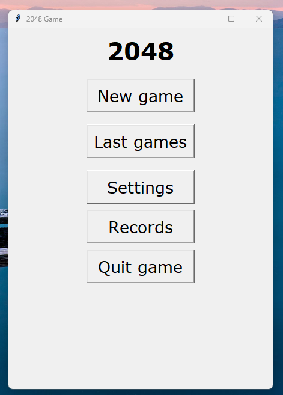
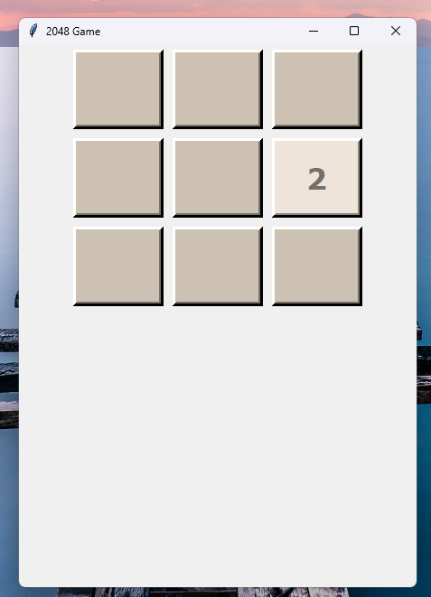
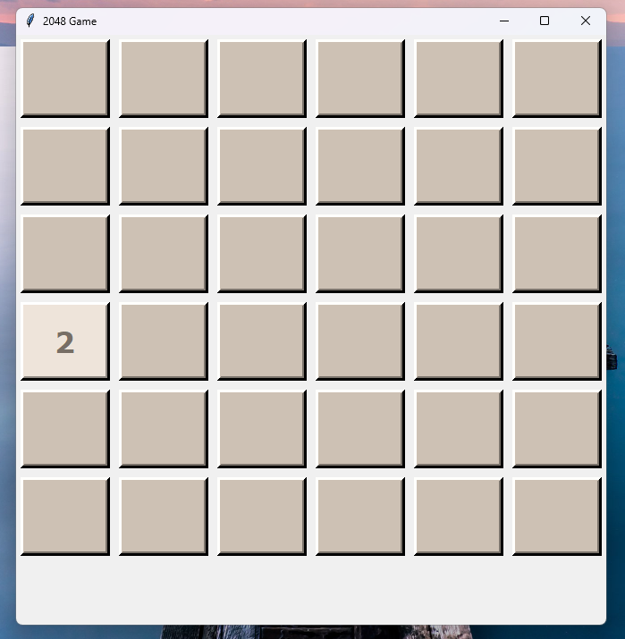

# 2048 Game (Python + Tkinter)

A Python implementation of the popular 2048 puzzle game, featuring a simple GUI built with the Tkinter library.

## Features

- Classic 2048 gameplay
- Different levels of difficulty (Gameboard size|value which ends game)
  - 3x3|128
  - 4x4|1024
  - 4x4|2048 (standard game)
  - 5x5|2048
  - 6x6|4096
- Interactive graphical user interface (GUI) using Tkinter
- Keyboard controls for smooth play
- Previous scores and records tracking
- Lightweight and easy to run

## Screenshots

\
*Main menu of the game*

\
*The gameboard of the easiest level*

\
*The gameboard of the hardest level*

## Getting Started

### Prerequisites

- Python 3.x
- Everything included in `reqirements.txt` file
```bash
# installation of the required packages
pip install -r requirements.txt
```

Tkinter is included with most Python installations. If you encounter issues, you may need to install it separately:

```bash
# For Ubuntu/Debian
sudo apt-get install python3-tk

# For MacOS/Homebrew
brew install python-tk
```

### Installation

1. **Clone the repository**
    ```bash
    git clone https://github.com/xxNauty/2048-game.git
    cd 2048-game
    ```

2. **Run the game**
    ```bash
    python main.py
    ```

## How to Play

- **Use arrow keys** (**or WSAD**) to move the[]() tiles.
- When two tiles with the same number touch, they merge into one.
- Try to reach the 2048 (or other value which ends the game) tile!
- The game ends when no moves are possible.

## Project Structure

```
├── backend             # holds actual game logic
├── gui                 # responsible for everything you see on the screen
├── logs                # informations about last 8 games played
├── records             # stores informations about your personal records
├── game_settings.json  # the file which stores informations about the levels of the game
└── main.py             # the main file of the game
```


## Contributing

Pull requests are welcome! If you find a bug or have a feature request, feel free to open an issue or submit a PR.

## License

This project is licensed under the "Unlicensed license".

---

**Enjoy playing 2048 in Python!**